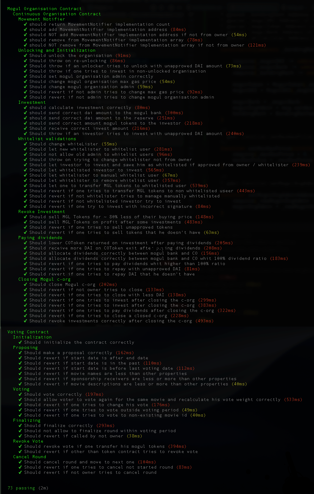

# Mogul Continuous Organization

## Continuous Organization
Continuous Organizations (COs) is innovative method for group-sourcing funds for different initiatives. Through COs, new business models can be devised and high capital requiring investment opportunities can be opened up to even the investors with smaller budgets. 

In their nature COs are a way to funnel investment from the crypto-digital world into the real world. When an investor invests funds into the CO, through cryptocurrency in a smart contract, they receive back tokens. You can think of this tokens as shares. 

The main goal for a CO is to use the invested funds and make such an investments so that they pay back dividends. These dividends are increasing the value of the tokens owned by the investors. 

In addition, in order to balance the risk-reward ratio of the early investors (who naturally take the most risk), the CO investment/tokens buy and sell ratios is governed by a complex mathematical model. Some of the rules of this model are outlined below:

- The buy and sell mathematical formulas are devised in such a way that at a given time, the buy price is always drastically higher than the sell price. This means that if you buy a single token now and sell it right away you will incur a substantial loss. Therefore, you are incentivized to hold for dividend payout or more people joining the CO after you.
- The less CO tokens are there in circulation - the lower (better) the price per single token bought is, and vice versa. This rewards the early investors for their high risk investment.
- The more CO tokens are in circulation - the better the sell price for a single token is. This disinsentivizes pump-and-dump actions towards the token

For detailed info and better understanding : [https://github.com/C-ORG/whitepaper](https://github.com/C-ORG/whitepaper)

## Mogul Studios

One such undertaking is the Mogul Productions innovative method for group-sourcing funds for movies production. 

Mogul Productions will set up a CO in order to group-source funds to invest in movies. The tokens received by the investors will be used for voting on a film to be invested in. The choices of films that an investor can invest in is selected by a highly qualified panel. The investors can vote in accordance with the amount of CO tokens they hold.

The project consists of two major parts - the continuous organization smart contract system and the voting system. Both of them have their own dedicated overview and specification pages:

- [Continuous Organization](docs/ContinuousOrganisation.md)
- [Voting System](docs/VotingContract.md)

## Current unit tests coverage

