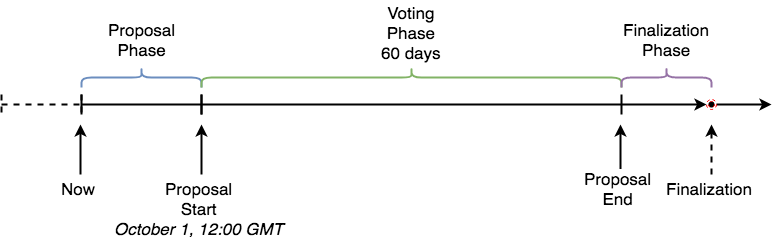

# Mogul Studios Movie Investment Voting Contract

The contract and processes described bellow serve the purpose of allowing Mogul Productions CO Token holders to make investment decisions.

An administrative user is allowed to submit proposals and investors need to have the ability to vote on the proposals. Hereafter the process of proposal, voting and finalization will be called investment round. Description of the process can be found below.

One investment round consists of three phases - Proposal, Voting and Finalization. The voting phase duration and start time should be defined when the proposals submission is created(by the admin user). The three phases always follow the exact same order and the end of the voting phase is considered the end of the round. There should not be two simultaneous rounds.

Example: Investment round with Voting phase starting on Proposal Start (Ex.October 1, 12:00 GMT) and length of 60 days. The numbers are arbitrary to showcase the example.

Stage 1. Proposal Phase

This is the phase where the proposer submits Round proposal. No voting can be done in this phase and only the proposer can invoke this functionality.

One round proposal consists of:

Array of film Proposals to be voted on

Start time for the voting round

Mapping between address and proposal id - used to determine if a given investor has voted or not and if so, for which proposal

Transfer of the maximum DAI that will be disbursed (equal to the amount of the highest requested money by a proposal)

Every Proposal should have:

Proposal ID - index

Total Votes counter - used for counting the votes during the voting period

Votes by address - saves how many votes a user has casted. Used for the recalculation if voted again (you have to subtract these votes from to total amount first and do the votes sqrt calculation anew) and for vote-withdrawal

Address of the investment receiver

Requested Investment amount

The start of the voting phase defines the end of this phase.

Stage 2. Voting Phase

This is the period where every MGL holder can vote for the film they like. Their votes are calculated as the square root of 10 times the tokens they own (SQRT(10xMGL)) and kept in the proposal votes counter. One user can vote just for one proposal. The trading of tokens after a vote is unlimited but vote-withdrawal mechanism is to be implemented.

The vote withdrawal mechanism

In order to avoid double voting problem without limiting the MGL liquidity and tradability an automatic vote-withdrawal mechanism needs to be put in place. Once a user decides to move their tokens via invoking the transfer , transferFrom or burnFrom token smart contract functions, the token needs to notify the Voting Smart Contract.

In order for this to happen the Voting Smart Contract need to define and adhere to an interface - MovementNotifier . This Interface needs to have the following method defined (and implemented in the Voting Smart Contract) onTransfer(from, to, value) . This method is going to be used for notifying the implementer (Voting Contract) about any invoking any of the three functions mentioned above.

The MGL token is augmented to be able to receive address of a contract implementing the interface and will notify this address via triggering the onTransfer method in any of the three situations above.

Note: This functionality will be used also as prevention for sending tokens to an address that is not whitelisted, thus ensuring that only accredited investors can receive MGL tokens. This will be defined in a later story, but it is good idea to augment the MGL token with array of MovementNotifier interfaces and trigger all of them, in order to avoid rework later.

Stage 3. Finalization Phase

This is the phase after the voting has finished. During this phase the proposer will trigger a function to finalize the voting, determine the result and disburse the money to the winner. The determined winner gets their investment immediately disbursed and this ends the investment round. If there is any excess amount left in the contract, it is returned to the proposer address.

 

## Functions Specification
